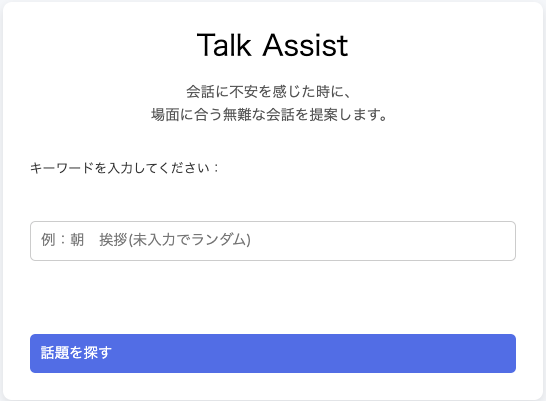
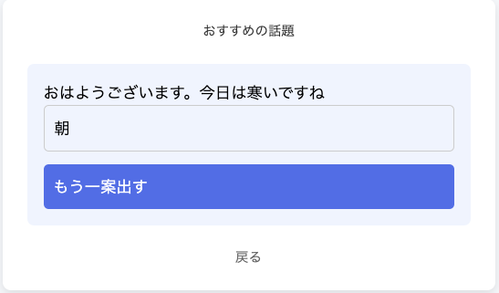

# Talk Assist

**会話に不安を感じる方に向けて、無難に会話への取っ掛かりを作りサポートするWebアプリ**

---
## 概要

会話が苦手な人でも、キーワード入力またはランダム表示により、自然な会話のきっかけを得られるWebアプリです。

---
## 開発背景・目的

日常会話や職場での雑談に苦手意識を持つ人は多く、「何を話せばいいかわからない」という心理的ハードルが存在します。

特に「正解のない会話」に対する不安が、会話を避ける要員になっていると考えました。

---
## 解決方法

キーワードに応じた会話例、またはランダムな会話を提示することで、会話の取っ掛かりを提供し、心理的ハードルを下げます。

---
## 主な機能

- キーワード検索(部分一致)
- ランダム会話提案(未入力時)
- 同一キーワードでの再提案
- 会話データのDB保存(MySQL)
---

## システム構成

Controller → Service → Repository の構成で責務を分離

- Controller: リクエスト処理
- Service: 検索・ランダム抽出ロジック
- Repository:DB操作(JPA)

---
## 処理の流れ
1. ユーザーがキーワードを入力(または未入力)
2. Controllerでリクエストを受け取る
3. Serviceで検索またはランダム処理を実行
4. Repositoryからデータ取得
5. 結果をViewへ返却

---
## 技術スタック
- Java 17
- Spring Boot
- Spring Data JPA
- Thymeleaf
- MySQL
- HTML/CSS(destyle.css使用)

---
## データ設計
- 会話データはMySQLで永続化
- data.sqlで初期データ投入
- データ消失を防ぐ設計

---

## 設計・実装で意識した点
- 未入力でも利用可能なUX設計
- Controller / Service / Repository による責務分離
- サーバー側にロジックを集約し、保守性を向上
- データ増加を想定した拡張性のある構成

---
## 課題
- 会話データの質と量を向上させる
- データ増加時の対応
- UIの改善

---

## 今後の改善
- 管理画面の実装
- カテゴリ分類機能
- ログイン機能(Spring Security)
- お気に入り機能

---
## スクリーンショット

### ホーム画面
キーワード入力または入力せずにランダム表示が可能です。

### 会話例
入力したキーワードに応じて会話例を表示します。

---

## 作者
- 眞野　貴史（就職活動用ポートフォリオ）

